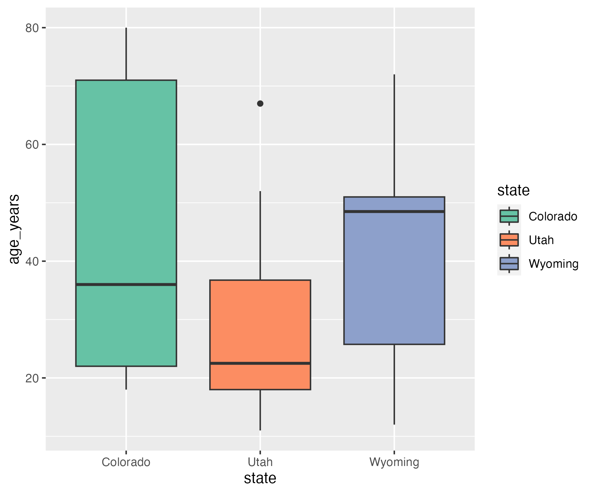

# My Sample Project

In this project, we calculate summary statistics on the ages of 
30 study participants across three US states. 


# Project Dependencies

To run this script, you will need to install the `tidyverse` package.

This package can be installed by running: 
```
install.packages("tidyverse")
```
in your R console.

This script runs using `R v4.2.2`, `tidyverse v2.0.0`, and `ggplot v3.4.4`.

# Running the Script

To run the script, you can either use RStudio to source `my_script.R` or run from the command line using
`RScript my_script.R`.

You will need to download the input data separately (not included in this repository).

# Results



Above we show a boxplot, with each box displaying distribution of ages for each state. 

The internal line in each box represents the median age for the state, with the lower and upper edges of the box representing the 1st and 3rd age quartiles. 
